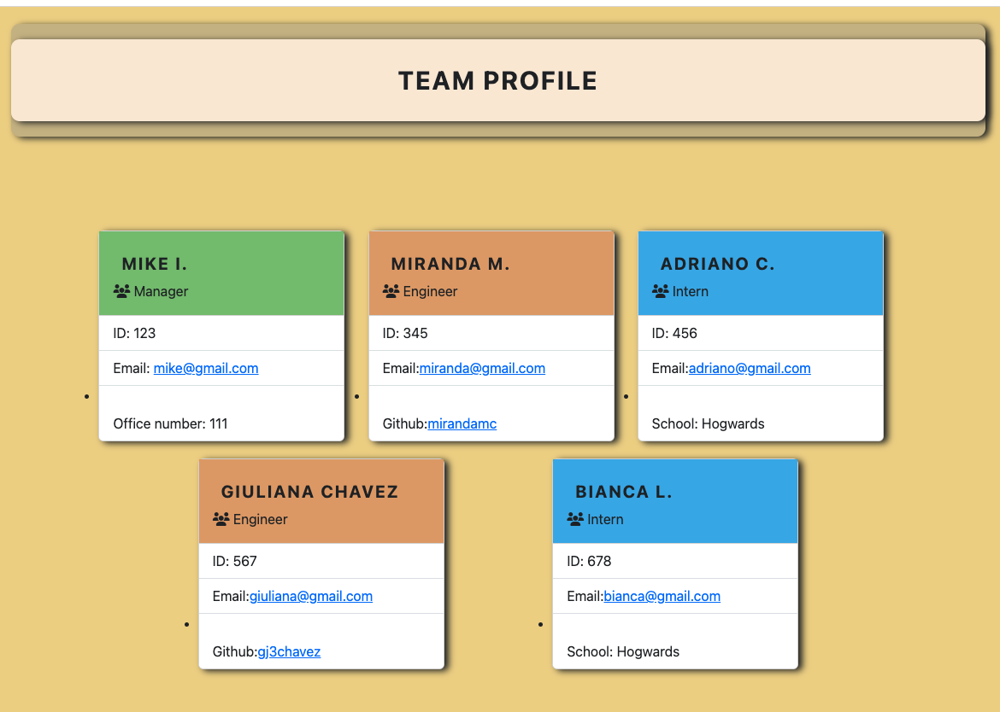

# Team Profile Generator
  

      

## Description
   As a developer, I want a Profile generator which quickly enables you to create a professional Profile for a new project.  
   This project is based in a node.js application that accepts user input from inquirer. 
   The app starts with a welcome message. Then the user is presented with a set of questions and choices that requiere their input. 
   After choosing a license, the respective license badge will be at the top of the Readme. 

   Link to demo video: https://drive.google.com/file/d/1LM87foXHhOzxLKSYExOb75Ck6rpx8qTN/view
## Screenshot

## Table of Contents
  - [Description](#Description)
  - [Installation](#Installation)
  - [Usage](#Usage)
  - [Contributing](#Contributing)
  
  - [Tests](#Tests)
  - [License](#License)
  - [Questions](#Questions)

  
## Installation 
   Follow the steps below:
- 1: Create a repo
- 2: Open terminal
- 3: Clone rep from Github
- 4: Create a "gitignore" file and include node_modules/ and .DS_Store/. 
     So that your node_modules directory isn't tracked or uploaded to GitHub. 
     Be sure to create your gitignore file before installing any npm dependencies
- 5: Create a folder: index.js
- 6: Initiate npm by entering: npm init
- 7: Download inquirer package by entering npm install inquirer
- 8: Type node index.js press enter
- 9: Follow prompts
    

## Usage
The application will be invoked with the following command in the integrated terminal: node index.js.
The application generates a professional Profile Generator from users's input. It uses the inquirer package: 
[npmjs.com](https://www.npmjs.com/package/inquirer)
  
## Contributing/Report issues
If you would like to contribute to this project or report an issue please email me at: myemailg@gmail.com
   

## Test
Test the app by opening up the terminal in VS Code you can run node index.js and answer the prompts.

## Questions
For questions please reach me at: myemail@gmail.com  
My Github: [Giuliana](https://github.com/myemail)

## License
  
  
  Copyright (c) 2023 gj3chavez

Permission is hereby granted, free of charge, to any person obtaining a copy
of this software and associated documentation files (the "Software"), to deal
in the Software without restriction, including without limitation the rights
to use, copy, modify, merge, publish, distribute, sublicense, and/or sell
copies of the Software, and to permit persons to whom the Software is
furnished to do so, subject to the following conditions:

The above copyright notice and this permission notice shall be included in all
copies or substantial portions of the Software.

THE SOFTWARE IS PROVIDED "AS IS", WITHOUT WARRANTY OF ANY KIND, EXPRESS OR
IMPLIED, INCLUDING BUT NOT LIMITED TO THE WARRANTIES OF MERCHANTABILITY,
FITNESS FOR A PARTICULAR PURPOSE AND NONINFRINGEMENT. IN NO EVENT SHALL THE
AUTHORS OR COPYRIGHT HOLDERS BE LIABLE FOR ANY CLAIM, DAMAGES OR OTHER
LIABILITY, WHETHER IN AN ACTION OF CONTRACT, TORT OR OTHERWISE, ARISING FROM,
OUT OF OR IN CONNECTION WITH THE SOFTWARE OR THE USE OR OTHER DEALINGS IN THE
SOFTWARE.